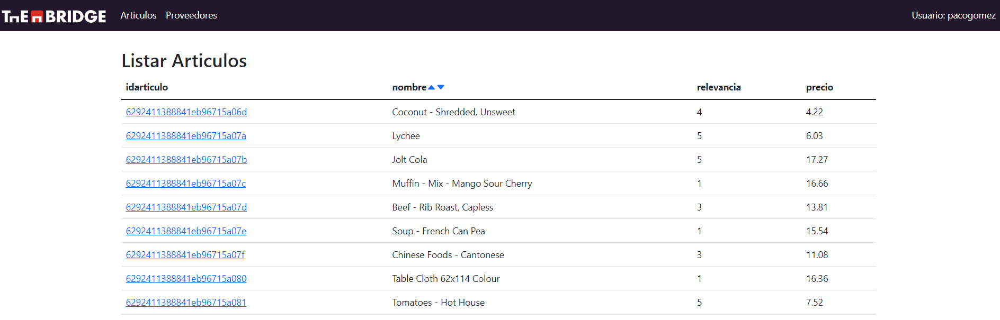
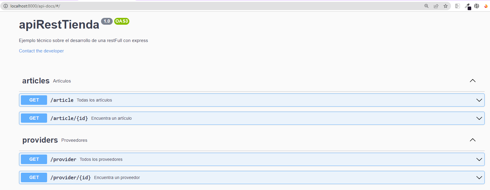

<div id="top"></div>
<!--
*** Thanks for checking out the Best-README-Template. If you have a suggestion
*** that would make this better, please fork the repo and create a pull request
*** or simply open an issue with the tag "enhancement".
*** Don't forget to give the project a star!
*** Thanks again! Now go create something AMAZING! :D
-->


<!-- PROJECT SHIELDS -->
<!--
*** I'm using markdown "reference style" links for readability.
*** Reference links are enclosed in brackets [ ] instead of parentheses ( ).
*** See the bottom of this document for the declaration of the reference variables
*** for contributors-url, forks-url, etc. This is an optional, concise syntax you may use.
*** https://www.markdownguide.org/basic-syntax/#reference-style-links
-->
[![Contributors][contributors-shield]][contributors-url]
[![Forks][forks-shield]][forks-url]
[![Stargazers][stars-shield]][stars-url]
[![Issues][issues-shield]][issues-url]
[![MIT License][license-shield]][license-url]
[![LinkedIn][linkedin-shield]][linkedin-url]


<!-- PROJECT LOGO -->
<br />
<div align="center">
  <a href="https://github.com/pacogomezarnal/thebridgeTienda">
    
  </a>

  <h3 align="center">Ejercicio práctico TheBridge</h3>

  <p align="center">
    Un ejemplo sobre tienda de artículos para la escuela TheBridge
    <br />
    <a href="https://github.com/othneildrew/Best-README-Template"><strong>Template README sobre Best-Readme-Template</strong></a>
  </p>
</div>


<!-- TABLE OF CONTENTS -->
<details>
  <summary>Contenido</summary>
  <ol>
    <li>
      <a href="#about-the-project">Sobre el proyecto</a>
      <ul>
        <li><a href="#built-with">Construido con</a></li>
        <li><a href="#backend">Backend</a></li>
        <li><a href="#frontend">Frontend</a></li>
      </ul>
    </li>
    <li>
      <a href="#getting-started">Comenzando</a>
      <ul>
        <li><a href="#prerequisites">Prerequisitos</a></li>
        <li><a href="#installation">Instalación</a></li>
      </ul>
    </li>
    <li><a href="#usage">Uso</a></li>
    <li><a href="#roadmap">Roadmap</a></li>
    <li><a href="#contact">Contacto</a></li>
  </ol>
</details>


<!-- ABOUT THE PROJECT -->
## Sobre el proyecto
<div align="center">
  
</div>

Con este pequeño desarrollo se pretende resolver el ejercicio práctico planteado por la escuela <a href="https://www.thebridge.tech/">TheBridge</a>. Se plantea el reto de escribir una aplicación que permita manejar un conjunto de artículos almacenados en una base de datos y relacionados con un proveedor.

Para ello:

* Se desarrolla un ApiRestFul que permitirá la interacción con la base de datos
* Se desarrolla un FrontEnd que se comunicará con el Backend para presentar la información

<p align="right">(<a href="#top">back to top</a>)</p>


### Construido con

En esta sección se listan de una forma general todos los frameworks/tecnologías usados dentro del proyecto, sin presentar plugins o librerías menores:

* [React.js](https://reactjs.org/)
* [Node](https://nodejs.dev/)
* [Express](https://expressjs.com/)
* [MongoDB](https://www.mongodb.com/)
* [Bootstrap](https://getbootstrap.com)

<p align="right">(<a href="#top">back to top</a>)</p>


### Backend

El backend se desarrolla con las tecnologías Node&Express para la realización de los siguientes endpoints que se pueden consultar a través de la ruta 'http://localhost:8000/api-docs/' una vez instalado y lanzado el proyecto.
<div align="center">
  
</div>

### FrontEnd

El FrontEnd realizado con tecnología React permite comunicarse con el Backend a partir de esos cuatro endpoints desarrollados

<!-- GETTING STARTED -->
## Comenzando

En los siguientes apartados se detalla el paso a paso para la correcta puesta en marcha del proyecto.

### Prerequisites

Es necesario para el correcto funcionamiento de la aplicación y cada una de sus partes tener instalado:

* MongoDB
* NPM
* Node

### Installation

El proyecto puede ser ejecutado de forma local realizando los siguientes pasos:

1. descarga desde el repositorio https://github.com/pacogomezarnal/thebridgeTienda
2. instalación de backend
  ```sh
  cd apiRestTienda
  npm instal
  ```
3. instalación de frontend
  ```sh
  cd frontTienda
  npm install
  ```
4. migración de datos a la base de datos MongoDB.
  ```sh
  cd apiRestTienda
  npm run data
  ```
5. ejecución
  ```sh
  cd apiRestTienda
  npm run start
  cd frontTienda
  npm run start
  ```


<p align="right">(<a href="#top">back to top</a>)</p>


<!-- USAGE EXAMPLES -->
## Uso

Abriendo en un navegador en el puerto  3000, de forma local podemos navegar por los diferentes listados:

1. Listar artículos


2. Ordenar artículos


3. Listar un artículo


4. Listar proveedores


<p align="right">(<a href="#top">back to top</a>)</p>


<!-- ROADMAP -->
## Roadmap

- [x] Creado endpoints del backend
- [x] Creado log de backend
- [x] Creado prueba unitaria de backend
- [x] Creada documentación con swagger de backend
- [x] Creado frontend
- [x] Creada naveción de frontend
- [x] Creado prueba unitaria de frontend


<p align="right">(<a href="#top">back to top</a>)</p>


<!-- CONTACT -->
## Contacto

Paco Gómez  LinkedIn - [LinkedIn](https://www.linkedin.com/in/paco-gomez-arnal/) - paco.gomez.arnal@gmail.com
Paco Gómez Youtube - [Youtube](https://www.youtube.com/c/PacoGomez)

Project Link: [https://github.com/pacogomezarnal/thebridgeTienda](https://github.com/pacogomezarnal/thebridgeTienda)

<p align="right">(<a href="#top">back to top</a>)</p>
